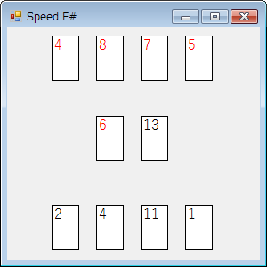

# speed_fs
Implementation of the card game "Speed".

## Screenshot
### GUI client

## See also 
* [Speed (card game) - Wikipedia](https://en.wikipedia.org/wiki/Speed_(card_game))

## License
All in this repository which **vain0** reserves all rights for are under public domain.

## Rule
**スピード** とは、トランプを用いた2人対戦 **アクション** ゲーム。

0. ジョーカーを除いた52枚のカードを、赤いカードと黒いカードの2つの束に分け、よく切って互いの山札とする。
0. 互いに自分の山札から4枚のカードを公開する。これを手札と呼ぶ。
0. ゲーム開始！　プレイヤーは以下の行動を **非同期的に** 行える。
  * 手札にあるカード1枚を場に出す。
    * 場にあるカードが2枚未満なら、任意の1枚のカードを出せる。
    * 場にあるカードがちょうど2枚なら、場にあるカード1枚の上に、それと数字が隣りあうカード1枚を重ねて置く。隣りあうとは、3 と 4 のように、数字がちょうど1つ異なるもの。
    * ただし、A, J, Q, K はそれぞれ 1, 11, 12, 13 とみなす。
    * また、A と K は隣りあうとみなす。
  * 自分の山札からカードを1枚引く。
    * 手札が4枚になるまで引く。4枚より多くのカードを手札に持つことはできない。
    * 手札は常に公開される。
  * 勝利する。
    * 自分の手札および山札にカードがないときだけ行える。
  * 互いに場に出せるカードがなくなったら、場にあるカードをすべて取り除く。
    * 普通の **スピード** のルールでは、「“スピード”と掛け声を出しながら、互いの手札から任意のカードを1枚ずつ場に出す」ことになっているようだ。
    * 場を初期化する方式のほうがプログラムが単純になるので、本プロジェクトではこちらの変則ルールを採用している。
